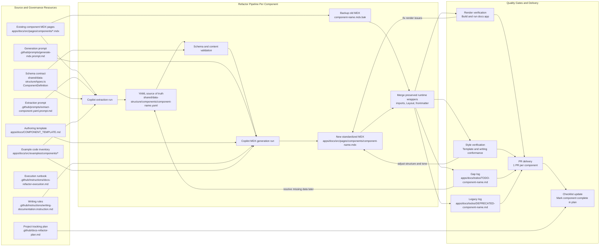
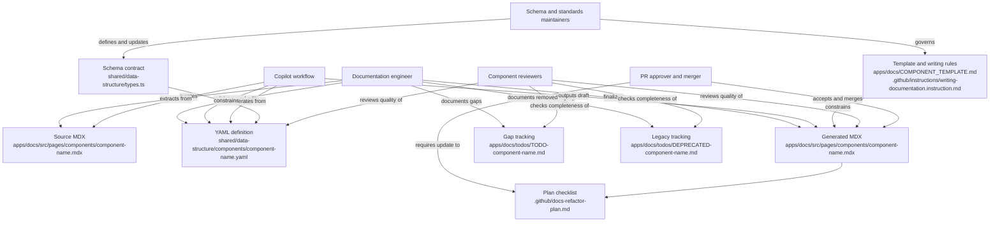

# Docs Refactor Architecture Diagram

This diagram maps the resources, transformation steps, validation gates, and outputs used in the component docs refactor workflow.

## Notes

- The YAML file is the machine-readable source of truth for each component.
- The generated MDX is the user-facing artifact and may require selective merge-back from the backup MDX to preserve Next.js page wiring.
- TODO and DEPRECATED files make migration debt explicit and reviewable per component PR.
- The final checklist update in the plan file closes the loop for program-level tracking.

## Ownership Diagram

This view maps the main roles to their primary responsibilities during a component refactor.

