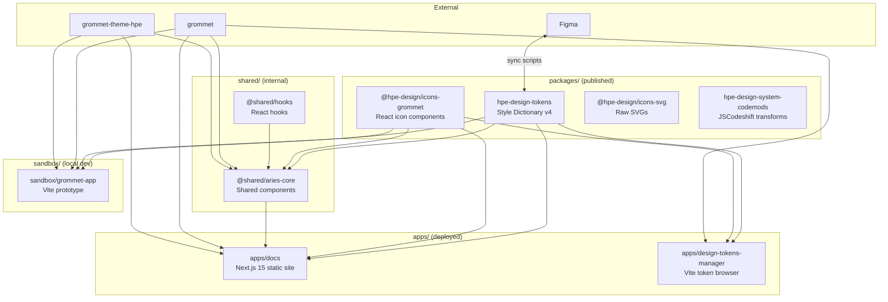

# HPE Design System — Monorepo Documentation

## Overview

This repository is a [pnpm workspace](https://pnpm.io/workspaces) monorepo containing all source code, documentation, and tooling for the HPE Design System. It is organized into four workspace roots:

| Root | Purpose |
|---|---|
| `apps/` | Deployed and user-facing applications |
| `packages/` | Published npm packages |
| `shared/` | Internal shared packages (not published independently) |
| `sandbox/` | Prototype and experimental apps |

---

## Package Map

### `apps/`

| Package | Description |
|---|---|
| `apps/docs` | Next.js 15 static-export documentation site ([design-system.hpe.design](https://design-system.hpe.design)) |
| `apps/design-tokens-manager` | Vite + React app for browsing and managing design tokens |

### `packages/`

| Package | npm | Description |
|---|---|---|
| `packages/hpe-design-tokens` | [`hpe-design-tokens`](https://www.npmjs.com/package/hpe-design-tokens) | Design tokens built with Style Dictionary v4; outputs ESM, CJS, CSS vars, and Grommet-compatible formats |
| `packages/icons-grommet` | [`@hpe-design/icons-grommet`](https://www.npmjs.com/package/@hpe-design/icons-grommet) | HPE icons as React components for Grommet |
| `packages/icons-svg` | [`@hpe-design/icons-svg`](https://www.npmjs.com/package/@hpe-design/icons-svg) | HPE icons in raw SVG format |
| `packages/codemods` | [`hpe-design-system-codemods`](https://www.npmjs.com/package/hpe-design-system-codemods) | JSCodeshift transforms for migrations (e.g. grommet-icons → @hpe-design/icons-grommet) |

### `shared/`

| Package | Description |
|---|---|
| `shared/aries-core` | Internal shared React components and Storybook; used by `apps/docs` |
| `shared/hooks` | Internal shared React hooks (TypeScript, tested with Vitest) |

### `sandbox/`

| Package | Description |
|---|---|
| `sandbox/grommet-app` | Vite + React prototype for testing components and tokens against multiple theme versions |
| `sandbox/mcp-ui` | Future development — not active |

---

## Architecture Diagram



---

## Token Architecture

Design tokens live in `packages/hpe-design-tokens/tokens/` and follow the [W3C Design Token Community Group](https://design-tokens.github.io/community-group/format/) format (`$type`, `$value`, `$description`).

### Three-layer hierarchy

```
tokens/
├── primitive/          # Raw values — brand colors, base sizes
│   └── primitives.default.json
├── semantic/           # Contextual aliases — references primitives
│   ├── color.light.json
│   ├── color.dark.json
│   └── dimension.default.json
└── component/          # Component-specific tokens
```

Versioned variants (`.v0`, `.v1`, current) exist in each layer to support gradual consumer migration.

### Build outputs (`packages/hpe-design-tokens/dist/`)

| Output | Path | Use case |
|---|---|---|
| ESM | `dist/esm/` | Modern JS bundlers |
| CJS | `dist/cjs/` | CommonJS consumers |
| CSS variables | `dist/css/` | Plain CSS / non-JS consumers |
| Grommet format | `dist/grommet/` | Direct use with `grommet-theme-hpe` |

Build: `pnpm --filter hpe-design-tokens build`

---

## Documentation Site Structure (`apps/docs`)

Pages are driven by a data-first pattern — structure files define all metadata, then MDX pages render it.

```
src/
├── data/structures/      # Page metadata registry (name, category, sections, SEO)
│   └── components.js     # One entry per documented component
├── examples/             # Live React code examples, one directory per component
│   └── components/<Name>/
│       ├── SomeExample.js
│       └── index.js      # barrel export
├── pages/                # Next.js routes (.js and .mdx)
│   └── components/<name>.mdx
├── layouts/
│   ├── content/          # Example, BestPracticeGroup, AccessibilitySection, etc.
│   └── main/             # AppHeader, Layout, ThemeMode
└── themes/
    └── aries.js          # deepMerge(hpe, {...}) — docs-specific theme overrides
```

Adding a component page requires three coordinated changes: a structure entry, an examples directory, and an MDX page. See [.github/copilot-instructions.md](.github/copilot-instructions.md) for the step-by-step pattern.

---

## Dependency Version Management

Shared dependency versions are declared once in `pnpm-workspace.yaml` under `catalog:` and referenced as `"catalog:"` in individual `package.json` files. Named catalogs support per-package Grommet version pinning:

```yaml
catalogs:
  grommet-stable:       # latest stable tarball from GitHub
  grommet-theme-hpe-v6: # v6.x for older consumers
  grommet-theme-hpe-v7: # v7.x for newer consumers
```

---

## Versioning & Publishing

Published packages use [Changesets](https://github.com/changesets/changesets) for versioning:

- `hpe-design-tokens`
- `@hpe-design/icons-grommet`
- `@hpe-design/icons-svg`
- `hpe-design-system-codemods`

The `design-tokens-stable` branch tracks stable token releases and receives automated updates via `.github/workflows/update-design-tokens-stable.yml`.

Figma ↔ token sync is managed by two GitHub Actions workflows (`sync-figma-to-tokens.yml`, `sync-tokens-to-figma.yml`) and can also be run locally:

```bash
pnpm --filter hpe-design-tokens sync-figma-to-tokens
pnpm --filter hpe-design-tokens sync-tokens-to-figma
```
