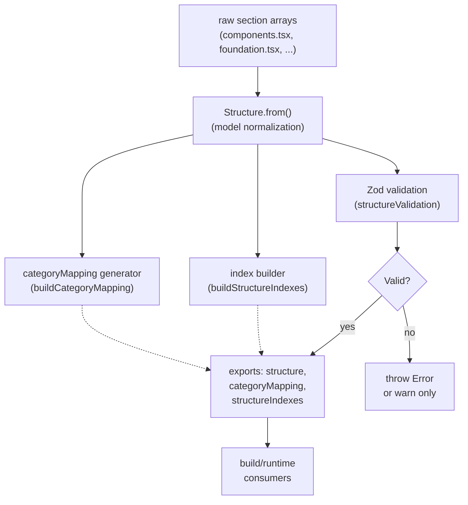

# RFC: Structure System Refactoring

**Status**: Phase 4 Complete (Validation + Indexes Integrated; TypeScript structure entrypoint delivered)  
**Author**: Design System Team  
**Date**: March 2026  
**Related**: Phase 1 Testing (✅ Complete) → Phase 2 Routes (✅ Complete) → Phase 3 Categories (✅ Complete) → Phase 4 Architecture (✅ Complete)

---

## Problem Statement

The current structure system in the HPE Design System docs has several critical issues:

### **Critical Issues**
1. **No validation or tests** - 2000+ lines of data with zero runtime validation
2. **Hardcoded route mappings** - Nested pages require manual URL mappings in code
3. **Duplicate category mapping** - categoryMapping must be manually synced
4. **Mixed concerns** - SEO, routing, display, and categorization all in one place
5. **Fragile string references** - No referential integrity, easy to break with typos
6. **50+ dependent files** - Changes ripple across the entire codebase

### **Impact**
- Difficult to add new pages or change structure
- Easy to create bugs that aren't caught until runtime
- Maintainability decreases as system grows
- Onboarding new contributors is difficult

---

## Goals

1. **Safety**: Add comprehensive test coverage before any refactoring
2. **Data-driven**: Remove hardcoded route mappings
3. **DRY**: Eliminate duplicate category definitions
4. **Clarity**: Separate routing, content, and display concerns
5. **Scalability**: Make it easy to add/modify pages
6. **Type Safety**: Enforce schema at build time

---

## Implemented Solution

### **Phase 2: Remove Hardcoded Routes** ✅ COMPLETE

- Routing is data-driven, including explicit `path` overrides for nested pages.
- Hardcoded route exceptions were removed from runtime path resolution.
- Route parity tests were added to lock URL behavior and prevent regressions.

### **Phase 3: Auto-Generate Category Mapping** ✅ COMPLETE

- Category grouping is generated from structure data via `buildCategoryMapping()`.
- Navigation consumers use generated mappings (no manual sync table).
- Category order/weights are derived from generated mapping for deterministic sorting.

### **Phase 4: Validation, Indexes, and Type Safety** ✅ COMPLETE

- Build-time and runtime validation now run through Zod-backed checks.
- Pre-built indexes (`byName`, `bySlug`, `byParent`, `byCategory`) are generated once and reused.
- Runtime consumers now resolve lookups through index-backed helpers.
- The structure assembly entrypoint is TypeScript (`structure.tsx`) and exports typed indexes/mappings.

### **Current Guardrails in Effect**

- Default strict validation behavior fails build/runtime on structure integrity errors.
- Local warn-only mode is available through env flags for migration/debug workflows.
- CI enforces structure validation, docs unit tests, and docs build gates.

---

## Testing Strategy

### **Implemented Test Coverage**
- Structure validation tests (schema + referential integrity + collision checks)
- Utility/search/navigation tests
- Route parity tests for URL stability
- Category mapping tests (mock + live data integration)

### **CI Integration**
The docs workflow (`.github/workflows/docs-unit-tests.yml`) enforces:

1. `pnpm --filter docs validate:structure`
2. `pnpm --filter docs test:unit`
3. `pnpm --filter docs build` (pull requests)

---

## Migration Timeline

| Phase | Status | Result |
|-------|--------|--------|
| Phase 1: Tests | ✅ Complete | Baseline coverage and guardrails established |
| Phase 2: Routes | ✅ Complete | Data-driven pathing and parity protection shipped |
| Phase 3: Categories | ✅ Complete | Generated category mapping replaced manual mapping |
| Phase 4: Architecture | ✅ Complete | Validation, indexes, and TS entrypoint integrated |

**Progress**: 4 of 4 phases complete
**Current State**: Structure system refactor objectives are implemented and enforced in CI

---

## Success Metrics

- ✅ Route handling is data-driven; hardcoded exception mappings removed.
- ✅ Category mapping is generated from structure data and consumed by navigation.
- ✅ Validation is enforced in both CI and runtime/build flow.
- ✅ Index-backed lookup paths are integrated into runtime consumers.
- ✅ TypeScript structure entrypoint (`structure.tsx`) is active.

---

## Implementation Progress

### ✅ Delivered (March 2026)

- **Phase 1**: Validation/search/navigation tests established as baseline.
- **Phase 2**: Route pathing made data-driven and parity-tested.
- **Phase 3**: Category mapping generation and category-weight sorting integrated.
- **Phase 4**: Zod validation, index generation, strict runtime/build gating, and TypeScript structure entrypoint delivered.

### ✅ Current Status

- No pending RFC phase work remains for this refactor.
- The refactor is now an operational baseline guarded by CI and validation checks.

---

## Resolved Decisions

### Carry-Forward Items (Completed)

1. **Live-data integration tests for category mapping** ✅ RESOLVED
   - **Original goal**: Assert generated `categoryMapping` for `Foundation` and `Components` against live structure data.
   - **Resolution**: Implemented 4 new integration tests in `buildCategoryMapping.test.ts` verifying category grouping and weight derivation for both hubs.
   - **Status**: All passing; provided end-to-end validation that auto-generated mapping matches expected behavior.

2. **TypeScript migration of structure entry point** ✅ RESOLVED
   - **Original goal**: Convert `structure.js` to TypeScript (`structure.tsx`).
   - **Resolution**: Migrated to `structure.tsx` with typed imports, JSX icon functions, and full type coverage for structure assembly.
   - **Status**: Active in production; type safety enforced at module level.

3. **TypeScript Migration of Child Structure Files** ✅ RESOLVED
   - **Original goal**: Migrate all structure data files (components.js, foundation.js, learn.js, tokens.js, templates.js).
   - **Resolution**: Migrated all to TypeScript/TSX (components.tsx, foundation.tsx, learn.tsx, tokens.tsx, templates.tsx, content-layouts.ts).
   - **Status**: Full structure layer is now TypeScript; type safety enforced across all data modules.

### Deferred Decisions (Decision Made)

1. **Option B: Separate Configuration Files**
   - **Question**: Should we split structure into dedicated `routes.config`, `content.config`, `navigation.config` files?
   - **Decision**: Deferred
   - **Rationale**: Option A (flat array + indexes) was lower risk and provided sufficient separation for operational needs. Option B can be revisited if structure complexity grows further.

2. **Warn-only Mode Longevity**
   - **Question**: Should local warn-only validation mode be kept long term?
   - **Decision**: Kept as intended
   - **Rationale**: Strict mode remains default in CI/build. Warn-only flags (`STRICT_STRUCTURE_VALIDATION=false`, `STRUCTURE_VALIDATION_WARN_ONLY=true`) are available for local migration and debug workflows, not production use.

3. **Icon Function Handling in Data**
   - **Question**: Should icon functions be replaced with identifier strings to separate JSX from data?
   - **Decision**: Unchanged
   - **Rationale**: JSX icon lambdas are intentional—they allow lazy evaluation and keep icon rendering at the point of consumption. No refactoring planned; addresses are solved through type clarity and test coverage.

---

## Architecture & Developer Guide

### Data Assembly Pipeline

The structure system follows a strict data transformation pipeline to ensure consistency, catch errors early, and enable performant lookups:



### Key Design Decisions & Why

#### 1. **Flat Array + Pre-built Indexes (vs. Nested Tree)**
- **Decision**: Keep structure as a flat array; generate lookup indexes once at build time.
- **Why**: Easier to add/modify pages, simpler mental model, scales better. Tree structures are harder to validate (parent/child sync).
- **Trade-off**: Small build-time cost for major runtime benefit (40+ files use indexes per request).

#### 2. **Generated Category Mapping (vs. Manual Sync Table)**
- **Decision**: Derive `categoryMapping` from `category` properties on pages.
- **Why**: Single source of truth, catches typos, automatic when pages are added.
- **Trade-off**: Slightly slower generation, but happens once at build time. Manual mapping was error-prone.

#### 3. **Zod Validation at Build (vs. Runtime Only)**
- **Decision**: Run full validation as part of the docs build/test pipeline and CI workflows (after dependencies are installed); fail early.
- **Why**: Catches schema violations before deployment, provides clear error messages, enables strict CI gates.
- **Trade-off**: Adds ~50ms to docs build/validation steps (negligible for docs app scale; no impact on dependency installation).

#### 4. **Strict by Default, Warn-only Override**
- **Decision**: Build/CI fails on validation errors; local dev can opt-in to warn-only mode.
- **Why**: Prevents shipping broken structure, supports local iteration/migration workflows.
- **Trade-off**: Developers must fix issues before committing (acceptable—errors are usually straightforward).

#### 5. **JSX Icons in Data (vs. Icon Identifier Strings)**
- **Decision**: Store icon functions as React lambdas in structure data.
- **Why**: Lazy evaluation, decoupling from export system, icon rendering stays at point of consumption.
- **Trade-off**: Mixes JSX with data (minor concern given TS type safety and test coverage).

### Extension Patterns

#### Adding a New Hub (Section)

1. Create a new section file (e.g., `structures/patterns.tsx`):
```typescript
import { StructureItem } from './Structure';

export const patterns: StructureItem[] = [
  {
    name: 'Page Layout',
    category: 'Layouts',
    parentPage: 'Patterns',
    description: '...',
  },
  // ... more pages
];
```

2. Export from `structures/index.ts`:
```typescript
export * from './patterns';
```

3. Add to assembly in `structure.tsx`:
```typescript
import { patterns as patternsArr } from './structures';

const patterns = Structure.from(patternsArr);
// ... add to initialStructure array
```

Validation and indexes are regenerated automatically; no other changes needed.

#### Adding a New Category

1. Add to `ALLOWED_CATEGORIES` in `structureValidation.ts`:
```typescript
export const ALLOWED_CATEGORIES = new Set([
  'All',
  'Assets',
  'Controls',
  'Data',
  'Inputs',
  'Layout',
  'Layouts',
  'Philosophy',
  'Visualizations',
  'MyNewCategory',  // ← Add here
  // ...
]);
```

2. Use in page definitions:
```typescript
{
  name: 'New Page',
  category: 'MyNewCategory',
  // ...
}
```

3. Navigation automatically groups and sorts by the new category.

#### Modifying Sort Behavior

The system uses `cardOrder` (numeric weight) and `sortByCategory()` (derived from `categoryMapping` order):

```typescript
// In structure.tsx
const components = Structure.from(componentsArr)
  .sortByName()           // alphabetical
  .sortByCardOrder()      // then by cardOrder property
  .map(page => page.name);
```

To change category ordering within a hub, modify the order they appear in `buildCategoryMapping` output (they're processed in page order).

### Common Pitfalls & How to Avoid

#### 1. **Broken Parent/Child Links**
```typescript
// ❌ BAD: Parent doesn't know about child
{ name: 'Button', parentPage: 'Components' }  // Components doesn't have 'Button' in .pages

// ✅ GOOD: Parent and child are synchronized
// In Components: { pages: ['Button', ...] }
// In Button: { parentPage: 'Components' }
```
**Caught by**: Validation rule "Parent mismatch"

#### 2. **Typos in relatedContent or parentPage**
```typescript
// ❌ BAD: 'Buton' doesn't exist
{ name: 'Form', relatedContent: ['Buton'] }

// ✅ GOOD: Exact match (case-sensitive)
{ name: 'Form', relatedContent: ['Button'] }
```
**Caught by**: Validation rule "references missing relatedContent"

#### 3. **Slug Collisions**
```typescript
// ❌ BAD: Two pages generate same slug 'call-to-action'
{ name: 'Call to action card', ... }
{ name: 'Call to action', ... }

// ✅ GOOD: Use explicit path to disambiguate
{ name: 'Call to action card', path: '/components/card/call-to-action-card' }
```
**Caught by**: Validation rule "Slug collision"

#### 4. **Invalid Category**
```typescript
// ❌ BAD: Category not in allowlist
{ name: 'Button', category: 'Interactive' }  // → validation error

// ✅ GOOD: Match allowlist exactly
{ name: 'Button', category: 'Controls' }
```
**Caught by**: Validation rule "Invalid category"

#### 5. **Modifying Exported Structure at Runtime**
```typescript
// ❌ BAD: Mutating imported structure
import { structure } from '../data';
structure[0].name = 'Modified';  // Don't do this!

// ✅ GOOD: Use helpers and trust indexes
import { getPrimaryPageByName, structureIndexes } from '../data';
const page = getPrimaryPageByName('Button', structureIndexes);
```
**Pattern**: Treat `structure`, `categoryMapping`, and `structureIndexes` as immutable; use accessor functions.

### When to Evolve the System

#### Revisit Option B (Separate Config Files) if:
- Structure needs explicit routing configuration separate from content
- Icon handling becomes unwieldy
- Need to support dynamic structure loading at runtime

#### Extend Validation if:
- New referential integrity constraints emerge (e.g., "all hub parents must have icons")
- Business rules require semantic validation beyond schema

#### Consider Full TS Migration of Child Files if:
- Adding rich type metadata to pages (beyond current scope)
- Build-time code generation becomes necessary

### Performance Considerations

| Operation | Cost | When |
|-----------|------|------|
| Build-time validation | ~50ms | Every build |
| Index generation | ~10ms | Every build |
| Lookup (byName/bySlug) | O(1) | Every page render |
| Category grouping (byCategory) | O(1) | Every nav render |

All lookups are pre-computed and cached; runtime performance is not a constraint.

---

## References

- **Developer Onboarding**: [Structure Data Module README](src/data/README.md) — Quick start guide for adding/modifying pages
- **Phase 1 Test Implementation**: [Test Suite](src/data/__tests__/)
- **Current Structure System**: [assembly logic](src/data/structure.tsx)
- **Navigation Implementation**: [Navigation Items](src/layouts/navigation/navItems.ts)
- **Utility Functions**: [Search & lookup utilities](src/utils/search.js)
