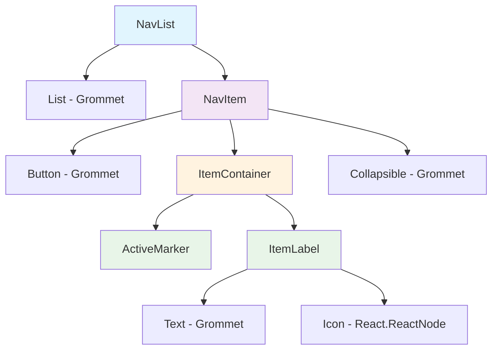
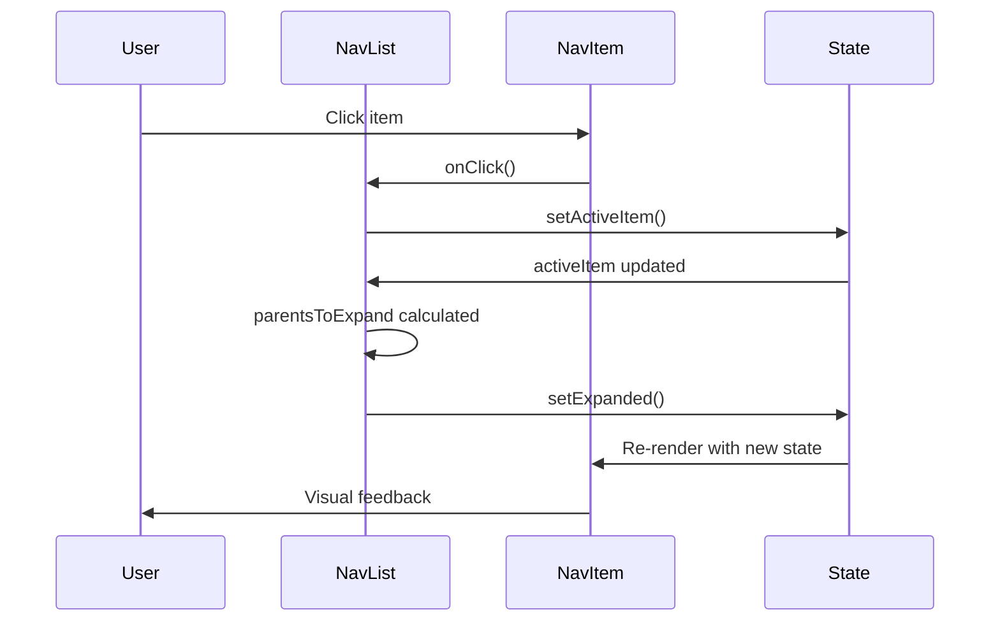

# Navigation Menu Components Documentation

## Overview

The Navigation Menu component system provides a hierarchical, accessible navigation interface for applications. It consists of several interconnected components that work together to create an interactive navigation experience.

## Component Architecture



## Components

### NavList

The main container component that manages navigation state and renders navigation items.

**Props:**

- `items: NavItemWithLevel[]` - Array of navigation items
- `activeItem?: string` - Currently active item label
- `setActiveItem?: (item: string | undefined) => void` - Callback to set active item
- `onSelect?: () => void` - Callback when an item is selected
- `...rest` - Additional props for accessibility (role, aria-labelledby, etc.)

**Features:**

- **Automatic expansion**: Parent items are automatically expanded when their children are active
- **Multi-level nesting**: Supports hierarchical navigation structures
- **State management**: Tracks expanded/collapsed state of parent items
- **Performance optimization**: Uses `useMemo` for expensive calculations

### NavItem

The core navigation item component that renders individual navigation entries.

**Props:**

- `active?: boolean` - Whether the item is currently active
- `actions?: React.ReactNode` - Action elements (expand/collapse icons)
- `children?: React.ReactNode` - Child content (nested navigation)
- `icon?: React.ReactNode` - Icon to display with the item
- `label: string` - Display text for the item
- `level?: 1 | 2` - Nesting level (affects indentation)
- `onClick?: () => void` - Click handler
- `url?: string` - URL for navigation (if applicable)
- `...rest` - Additional props (id, aria attributes, etc.)

**Visual States:**

- **Default**: Normal appearance
- **Hover**: Highlighted background
- **Active**: Distinct background with accent marker
- **Expanded**: Shows collapse icon, reveals children

### ItemContainer

Layout wrapper that provides consistent styling and state-based visual feedback.

**Props:**

- `active: boolean | undefined` - Active state
- `children: React.ReactNode` - Content to wrap
- `gap?: string` - Spacing between elements (default: 'xsmall')
- `hover: boolean` - Hover state

**Features:**

- **Responsive layout**: Uses Grommet Box for flexible layout
- **State-based styling**: Different backgrounds for active/hover states
- **Consistent spacing**: Standardized padding and gaps

### ItemLabel

Text and icon display component for navigation items.

**Props:**

- `icon: React.ReactNode` - Icon element
- `label: string` - Text label

**Features:**

- **Icon-text alignment**: Proper alignment of icon and text
- **Consistent typography**: Uses design system text styles
- **Flexible icons**: Accepts any React node as icon

### ActiveMarker

Visual indicator for active navigation items.

**Props:**

- `active: boolean | undefined` - Whether parent item is active
- `hover: boolean | undefined` - Whether parent item is hovered

**Features:**

- **Visual feedback**: Colored bar indicating active state
- **State-responsive**: Different colors for active and hover states
- **Subtle design**: Minimal visual element that doesn't interfere with content

## Types

### NavItemType

```typescript
export type NavItemType = {
  label: string; // Display text
  url?: string; // Navigation URL
  icon?: React.ReactNode; // Display icon
  children?: NavItemType[]; // Nested items
};
```

### NavItemWithLevel

```typescript
type NavItemWithLevel = NavItemType & {
  level?: 1 | 2; // Nesting level for indentation
};
```

## Usage Examples

### Basic Navigation

```tsx
const basicNavItems: NavItemType[] = [
  {
    label: 'Dashboard',
    url: '/dashboard',
    icon: <Dashboard />,
  },
  {
    label: 'Settings',
    url: '/settings',
    icon: <Settings />,
  },
];

<NavList
  items={basicNavItems}
  activeItem="Dashboard"
  setActiveItem={setActiveItem}
/>;
```

### Hierarchical Navigation

```tsx
const hierarchicalNavItems: NavItemType[] = [
  {
    label: 'Components',
    icon: <Components />,
    children: [
      { label: 'Button', url: '/components/button' },
      { label: 'Input', url: '/components/input' },
      { label: 'Card', url: '/components/card' },
    ],
  },
  {
    label: 'Templates',
    icon: <Templates />,
    children: [
      { label: 'Dashboard', url: '/templates/dashboard' },
      { label: 'Form', url: '/templates/form' },
    ],
  },
];

<NavList
  items={hierarchicalNavItems}
  activeItem="Button"
  setActiveItem={setActiveItem}
  onSelect={() => console.log('Item selected')}
/>;
```

### Accessible Navigation

```tsx
<NavList
  items={navItems}
  activeItem={activeItem}
  setActiveItem={setActiveItem}
  role="navigation"
  aria-label="Main navigation"
/>
```

## State Management Flow



## Accessibility Features

### ARIA Support

- `role="menubar"` on main list
- `role="menu"` on nested lists
- `role="menuitem"` on individual items
- `aria-haspopup` for items with children
- `aria-expanded` for collapsible items
- `aria-labelledby` for nested menus

### Keyboard Navigation

- Compatible with standard menu navigation patterns
- Supports screen readers through semantic markup
- Proper focus management

### Visual Accessibility

- High contrast active states
- Clear hover indicators
- Consistent spacing and typography
- Scalable icons and text

## Performance Optimizations

### Memoization

- `useMemo` for expensive parent-finding calculations
- `useMemo` for item level adjustments
- Prevents unnecessary re-renders

### State Updates

- Efficient expansion state management
- Minimal re-renders when state changes
- Optimized dependency arrays

## Styling and Theming

The components use Grommet's theming system for consistent styling:

- **Background colors**: `background-active`, `background-hover`
- **Text colors**: `text-strong`
- **Primary colors**: `background-primary-strong`
- **Spacing**: Design system spacing tokens
- **Border radius**: `xsmall` for subtle rounded corners

## Best Practices

### Data Structure

- Keep navigation hierarchy shallow (max 2 levels recommended)
- Use meaningful, descriptive labels
- Provide icons for better visual hierarchy

### Performance

- Avoid deep nesting in navigation data
- Use stable keys for list items
- Minimize state updates

### Accessibility

- Always provide meaningful labels
- Use appropriate ARIA attributes
- Test with screen readers
- Ensure keyboard navigation works

### UX Guidelines

- Keep navigation structure predictable
- Provide visual feedback for interactions
- Auto-expand parents of active items
- Use consistent iconography

## Browser Support

Compatible with modern browsers supporting:

- ES6+ JavaScript features
- React 18+
- CSS Grid and Flexbox
- Modern ARIA attributes

## Dependencies

- **Grommet**: UI component library
- **Grommet Icons**: Icon components
- **React**: Core framework (v18+)
- **TypeScript**: Type definitions

## Troubleshooting

### Common Issues

1. **Items not expanding**: Check that `activeItem` matches the exact label
2. **Styling issues**: Verify Grommet theme is properly configured
3. **Accessibility warnings**: Ensure proper ARIA attributes are set
4. **Performance issues**: Check for unnecessary re-renders in parent components

### Debug Tips

- Use React DevTools to inspect component state
- Check console for accessibility warnings
- Test keyboard navigation thoroughly
- Verify theme values in browser dev tools
