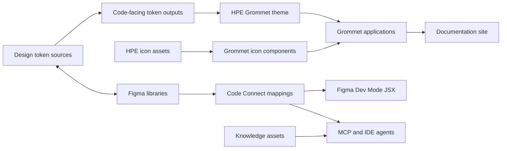

# HPE Design System AI Workflow Onboarding

This onboarding path is for contributors extending the HPE Design System's
design-to-HPE-Design-System-aligned-code pipeline and the knowledge assets that
support AI-first software delivery. The goal is not merely to produce code from
a design. It is to produce reviewable implementations that use approved HPE
Design System primitives, preserve the design intent, and leave reusable
evidence for the next workflow.

## Start Here

1. Read this product map to understand where each system concern is owned.
2. Follow the [first-week checklist](first-week.md) to set up and make a small,
   low-risk contribution.
3. Use the [design-to-code playbook](design-to-code-playbook.md) when evaluating
   or extending an AI-assisted implementation workflow.

## Product Map

| Product            | Purpose                                                                                                          | Primary location                                                                                            | Relationship to the pipeline                                                                                                                                                                         |
| ------------------ | ---------------------------------------------------------------------------------------------------------------- | ----------------------------------------------------------------------------------------------------------- | ---------------------------------------------------------------------------------------------------------------------------------------------------------------------------------------------------- |
| Design tokens      | Canonical design values and semantic vocabulary for color, typography, spacing, and more.                        | [packages/hpe-design-tokens](../../packages/hpe-design-tokens/)                                             | Token sources are built into code-facing artifacts, including a Grommet export, and are synchronized with Figma under a contract-validated process.                                                  |
| Figma libraries    | External libraries for tokens, components, examples, and icons.                                                  | [External Figma files](https://www.figma.com/files/815326206297160627/folder/334891093?fuid=797158032074964818)                                                                                        | They are governed for parity with the design-system tokens, components, patterns/templates, and icons. Figma is the design context; this repository owns the code and mapping assets described here. |
| Grommet            | React component library used for HPE Design System implementations.                                              | Catalog-managed dependency; local consumers use it throughout the workspace. [grommet](https://github.com/grommet/grommet)                               | Generated or hand-authored application code should prefer the appropriate Grommet primitive rather than recreating component behavior or styling.                                                    |
| grommet-theme-hpe  | HPE theme for Grommet.                                                                                           | Catalog-managed dependency; [pnpm-workspace.yaml](../../pnpm-workspace.yaml) declares supported versions. [grommet-theme-hpe](https://github.com/grommet/grommet-theme-hpe)  | It composes the HPE token vocabulary into the Grommet implementation layer. The current default catalog is version 8, aligned with current Landmark tokens.                                          |
| Icons              | Approved HPE icon assets in raw SVG and Grommet-aware React forms.                                               | [packages/icons-svg](../../packages/icons-svg/) and [packages/icons-grommet](../../packages/icons-grommet/) | The SVG package owns source assets; the React package provides themed, accessible components for Grommet applications. Use these instead of drawing substitute inline SVGs.                          |
| Documentation site | Published education and usage guidance for the design system.                                                    | [apps/docs](../../apps/docs/)                                                                               | The Next.js and MDX site explains the system to consumers. Its structural validation keeps navigation and content organization coherent.                                                             |
| Knowledge base     | Versioned instructions, skills, data, prompts, agents, schemas, and capability definitions for AI-assisted work. | [knowledge](../)                                                                                            | This is the reusable workflow layer. It turns system knowledge into repeatable, inspectable agent behavior.                                                                                          |
| Design-system agent | CLI/package that reads `knowledge/core/data` (components and patterns) and repository instructions to answer natural-language implementation queries. | [packages/design-system-agent](../../packages/design-system-agent/) | Powers the `alignment-audit` capability's evaluation step and is the canonical way to check what the knowledge base currently surfaces for a given feature request. |
| Figma Code Connect | Repository-owned Figma Dev Mode mappings to real Grommet JSX.                                                    | [knowledge/code-connect](../code-connect/)                                                                  | It connects a Figma component to approved production-oriented code for human handoff and provides useful implementation context to MCP and IDE agents.                                               |

## How The Pieces Relate

The arrows identify intended information flow, not a claim that every asset is
generated automatically. Keep the following boundaries clear when contributing:

- Token source data is authoritative for token values. Do not encode ad hoc
  copies of those values into generated examples.
- Figma libraries are external and parity-governed. Do not infer undocumented
  library internals from this repository.
- Code Connect publishes Dev Mode metadata. It does not generate production
  application source files or change Figma visual design content.
- `grommet` and `grommet-theme-hpe` are consumed as workspace dependencies, not
  maintained as source packages in this repository.
- The docs application teaches and demonstrates the system; the relevant
  package, token source, or structured knowledge asset remains the canonical
  implementation reference.

## Current Operating Model

The pipeline has useful production-capable pieces and deliberate areas of
experimentation:

- **Operational:** token build and contract checks; Grommet/theme/icon package
  consumption; the docs application; existing Code Connect mappings and their
  Figma publish workflow; knowledge skills and instructions; the
  [design-system-agent](../../packages/design-system-agent/) context generator
  over `knowledge/core/data`.
- **Active capability examples:**
  [docs-refactor](../capabilities/docs-refactor/manifest.yaml) demonstrates how
  a capability brings together structured data, skills, agents, stages, and
  verification.
  [alignment-audit](../capabilities/alignment-audit/manifest.yaml) demonstrates
  an evaluate → plan → execute loop that audits a consumer app or scope against
  the knowledge base and repo guidance, delegating to dedicated sub-agents.
- **Evaluation work:** [the design-to-code evaluation plan](../../docs/DESIGN_TO_CODE_EVAL.md)
  starts with simple artifacts and uses the Grommet sandbox to assess generated
  React code.
- **Planned or evolving work:** most capability bundles listed in
  [the knowledge index](../README.md) are marked planned. Treat their manifests
  as design inputs, not proven automation, until their status and validation
  evidence say otherwise.

## Primary References

- [Repository overview](../../README.md)
- [Design tokens README](../../packages/hpe-design-tokens/README.md)
- [Code Connect README](../code-connect/README.md)
- [Knowledge skills index](../core/skills/README.md)
- [Design-to-code evaluation plan](../../docs/DESIGN_TO_CODE_EVAL.md)
- [Grommet sandbox](../../sandbox/grommet-app/)

## Working Expectations

Every contribution should make the pipeline more reliable for a person and an
agent. Prefer small, verifiable changes; cite the source design context; use
existing HPE primitives; keep reusable guidance separate from one-off prompts;
and validate the rendered or published result before asking for review.
