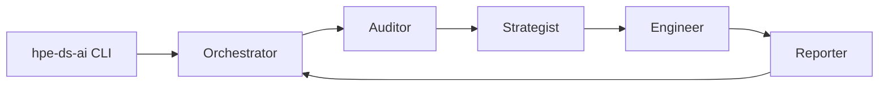
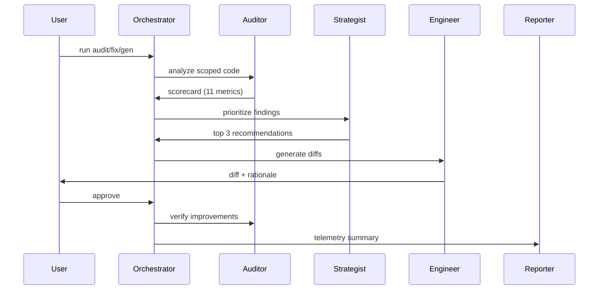

# HPE Design System Agent
## Designers + Engineers Kickoff

March 1, 2026

---

# Why this project exists

- UX alignment is hard to scale across 50+ teams
- Design system knowledge is deep, but hard to apply consistently
- We need measurable, repeatable UX compliance and improvement

---

# What this delivers

- **Audits** of design system alignment
- **Prioritized recommendations** for the top fixes
- **Remediation + generation** of HPE Design System aligned code
- **Human approval gates** before any change is applied

---

# System overview



---

# Continuous improvement loop



---

# Scoring dimensions (11)

**Consumer Implementation**
1. Component Coverage
2. Component Usage
3. App Structure
4. Token Compliance
5. Responsive Layouts
6. Accessibility
7. Type Safety & Interfaces
8. Dev Confidence

**Design System Enablement**
9. System Discoverability
10. Developer Experience
11. Agent Experience

---

# What a scorecard looks like (conceptual)

```json
{
  "consumerScore": 0.62,
  "systemScore": 0.48,
  "metrics": {
    "tokenCompliance": "warning",
    "componentUsage": "fail",
    "accessibility": "pass"
  },
  "topFindings": [
    "Hardcoded colors in Button",
    "Non-Grommet table component"
  ]
}
```

---

# Knowledge base (high level)

- **Tokens:** primitive, semantic, component
- **Components:** props, accessibility, examples
- **Patterns:** reusable UI solutions (login form, data table, etc.)

---

# Example knowledge snippet (YAML)

```yaml
name: "button"
props:
  - name: label
    type: string
    required: true
accessibility:
  - role: button
examples:
  - label: "Basic usage"
    code: "<Button primary label=\"Click me\" />"
```

---

# What the PoC includes

- Segment A only: React + Grommet + `grommet-theme-hpe`
- Remediable metrics in PoC: Token Compliance, Component Usage
- Generation inputs: text prompt, Figma JSON, PRD
- Human approval gates for all diffs

---

# What is out of scope (for now)

- Non-React frameworks
- Non-Grommet UI libraries
- Pattern audit scope
- CI/PR passive mode

---

# Roadmap overview


---

# How to think about impact

- Faster UX alignment without manual audits
- Shared language for design system gaps
- Clear, prioritized fixes instead of long checklists

---

# Next steps

- Kick off PoC implementation (Workstream 1)
- Identify 3-5 pilot teams
- Collect feedback, iterate, scale to MVP

---

# Q&A

What should we clarify or adjust before PoC starts?
