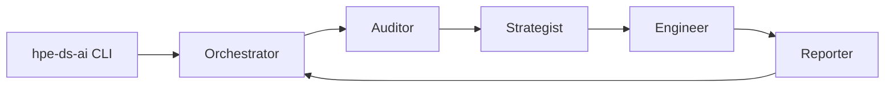
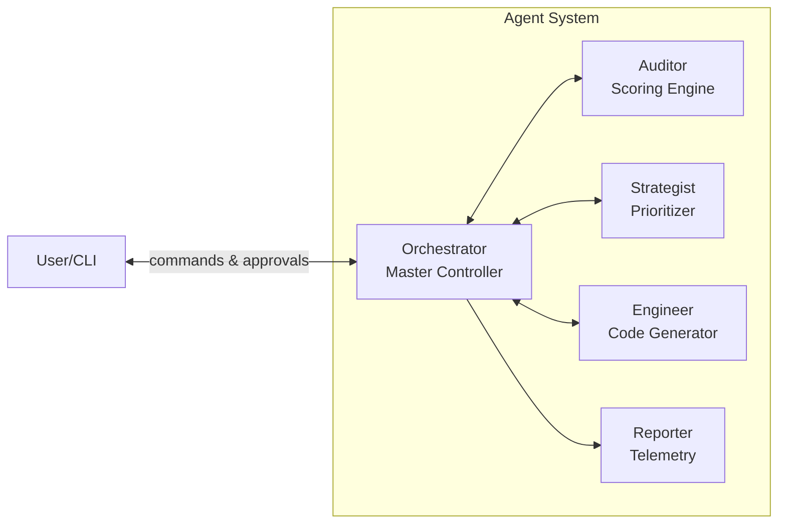
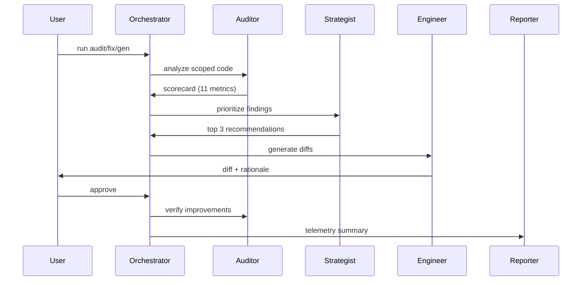
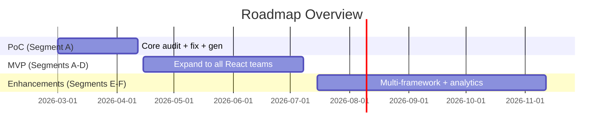

# HPE Design System Agent
## Designers + Engineers Kickoff

March 1, 2026

---

# Why this project exists

- UX alignment is hard to scale across 50+ teams
- Design system knowledge is deep, but hard to apply consistently
- We need measurable, repeatable UX compliance and improvement

---

# What this delivers

- **Audits** of design system alignment
- **Prioritized recommendations** for the top fixes
- **Remediation + generation** of HPE Design System aligned code
- **Human approval gates** before any change is applied

---

# System overview






---

# Continuous improvement loop



---

# What it evaluates (11 dimensions)

| Category | Dimension | Description |
| --- | --- | --- |
| **Consumer Implementation** | Component Coverage | How much of the UI uses design system components. |
|  | Component Usage | Whether components are used correctly and consistently. |
|  | App Structure | Layout and composition follow system guidance. |
|  | Token Compliance | Colors, spacing, type use design tokens. |
|  | Responsive Layouts | UI adapts properly across breakpoints. |
|  | Accessibility | Meets baseline accessibility expectations. |
|  | Type Safety & Interfaces | Types and props align to system contracts. |
|  | Dev Confidence | Signals for reliable, low-friction usage. |
| **Design System Enablement** | System Discoverability | Ease of finding the right system guidance. |
|  | Developer Experience | Clarity and usability of system assets and docs. |
|  | Agent Experience | How well the system supports the agent workflow. |


---

# What a scorecard looks like (conceptual)

```json
{
  "consumerScore": 0.62,
  "systemScore": 0.48,
  "metrics": {
    "tokenCompliance": "warning",
    "componentUsage": "fail",
    "accessibility": "pass"
  },
  "topFindings": [
    "Hardcoded colors in Button",
    "Non-Grommet table component"
  ]
}
```

---

# Knowledge base (high level)

- **Tokens:** primitive, semantic, component
- **Components:** props, accessibility, examples
- **Patterns:** reusable UI solutions (login form, data table, etc.)

---

# Example knowledge snippet (YAML)

```yaml
name: "button"
props:
  - name: label
    type: string
    required: true
accessibility:
  - role: button
examples:
  - label: "Basic usage"
    code: "<Button primary label=\"Click me\" />"
```

```yaml
name: Menu
description: Button that opens a dropdown menu with a list of actions or navigation items.
props:
- name: items
  type: '{ label: string, onClick?: () => void, icon?: React.ReactNode, gap?: string }[]'
  required: true
  description: Array of menu items
accessibility:
  keyboard:
  - key: Escape
    action: Closes the menu and returns focus to the trigger button
examples:
  - label: "Basic usage"
    code: "<Button primary label=\"Click me\" />"
```

```yaml
id: data-table-with-filtering
name: Data Table with Filtering
description: Interactive data table with built-in filtering, sorting, and pagination
  using Grommet Data components.
problem: Need to display large data collections with user controls for filtering,
  sorting, and viewing subsets of data.
solution: Use Grommet's Data component as a wrapper to manage data state. Add DataFilters,
  DataSearch, and DataSort for user controls. Display data with DataTable or alternative
  views (List, Grid). Use Pagination for large datasets.
relatedComponents:
- grid
- box
- text
- heading
- button
usage:
  whenToUse:
  - Use Data component to wrap your data collection and controls.
  - Provide DataSearch for quick text-based filtering.
  - Use DataFilters for structured filtering by field.

# ... 

examples:
- description: Basic Data Table with Search
  codeFile: design-system/examples/data-table-with-filtering/basic-data-table-with-search.tsx
- description: Table with Custom Filters
  codeFile: design-system/examples/data-table-with-filtering/table-with-custom-filters.tsx

# ...

graph:
  rootId: box-root
  nodes:
    - id: heading-title
      componentId: heading
      role: table heading
      props:
        level: 2
        content: "consumer-provided table title"
      children: []
      binding: slot
      notes: Heading text is consumer-provided (e.g. "Users", "Servers", "Applications").
```

---

# What the PoC includes

- Segment A only: React + Grommet + `grommet-theme-hpe`
- Remediable metrics in PoC: Token Compliance, Component Usage
- Generation inputs: text prompt, Figma JSON, PRD
- Human approval gates for all diffs

---

# What is out of scope (for now)

- Non-React frameworks
- Non-Grommet UI libraries
- Pattern audit scope
- CI/PR passive mode

---

# Roadmap overview



---

# How to think about impact

- Faster UX alignment without manual audits
- Shared language for design system gaps
- Clear, prioritized fixes instead of long checklists

---

# Next steps

- Kick off PoC implementation (Workstream 1)
- Identify 3-5 pilot teams
- Collect feedback, iterate, scale to MVP

---

# Q&A

What should we clarify or adjust before PoC starts?
