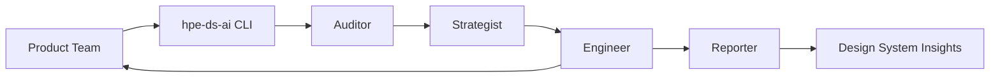
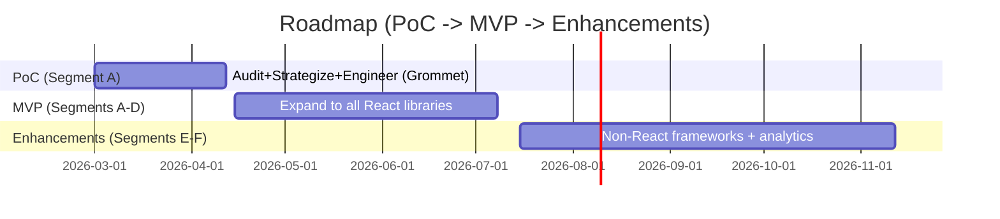

# HPE Design System Agent
## VP Stakeholder Overview

March 1, 2026

---

# Why this matters now

- Business is shifting from conglomerate to unified product experiences
- Backend/API architecture is governed; frontends remain fragmented
- UX alignment is often deprioritized vs. feature delivery
- Teams lack UX expertise, budget, or incentives to apply the design system consistently
- European Accessibility Act makes accessibility a go-to-market requirement

---

# The problem we are solving

- Fragmented UI slows time-to-compliance
- Inconsistent UX creates trust and usability risk
- Design system knowledge is hard to distribute at scale
- Compliance and accessibility gaps are expensive to discover late

---

# Our opportunity

The design system becomes the governance layer for UX:

- **Faster compliance** with measurable progress
- **Higher developer productivity** with guided fixes
- **Lower UX risk** by detecting gaps early
- **Shared language** across 50+ product teams

---

# The solution in one sentence

An AI-enabled, multi-agent design system copilot that audits, prioritizes, and remediates UX alignment with human approval gates.

---

# How it works (high level)

---

# What it evaluates (11 dimensions)

**Consumer Implementation**
1. Component Coverage
2. Component Usage
3. App Structure
4. Token Compliance
5. Responsive Layouts
6. Accessibility
7. Type Safety & Interfaces
8. Dev Confidence

**Design System Enablement**
9. System Discoverability
10. Developer Experience
11. Agent Experience

---

# Phased roadmap (high level)

---

# PoC focus (4-6 weeks)

**Scope**
- React + Grommet + `grommet-theme-hpe` (Segment A)

**Validate**
- Scoring accuracy across 11 dimensions
- Top 3 recommendations are actionable
- Fixes and generated code are accepted with minimal edits

**Outcome**
- Demonstrate measurable UX alignment improvements quickly

---

# What success looks like

- 80%+ of top 3 recommendations are actionable
- 70%+ of fixes accepted without modification
- 70%+ of generated code accepted with minimal edits
- 10+ point median improvement after applying fixes
- No scoring regressions after remediation

---

# Risks (light) and mitigation

- **Accuracy risk:** Pilot with 3-5 mature teams
- **Adoption risk:** Approval gates keep control with teams
- **Privacy risk:** No source code in telemetry; opt-out available

---

# What we need now

- Leadership alignment on the vision
- Support to pilot with 3-5 Segment A teams
- Fast feedback cycles to reach PoC exit criteria

---

# Next steps

- Kick off PoC implementation (Workstream 1: Orchestrator)
- Onboard pilot teams
- Review early results in 4-6 weeks

---

# Thank you

Questions?
