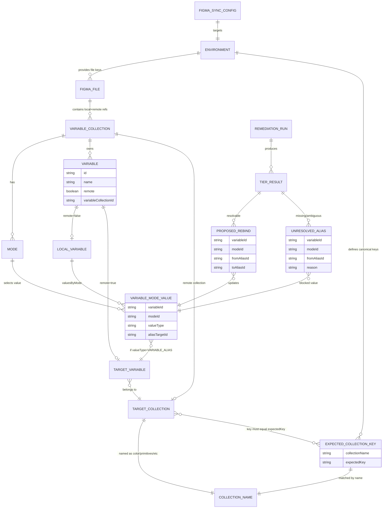
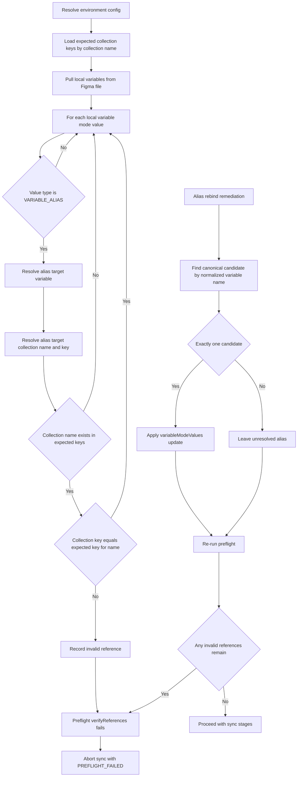

# Figma Sync Data Model Documentation

This document captures the core entity relationships involved in Figma sync, alias rebinding, and preflight validation.

## Entity Relationship Diagram

## Preflight Failure Flow Diagram

