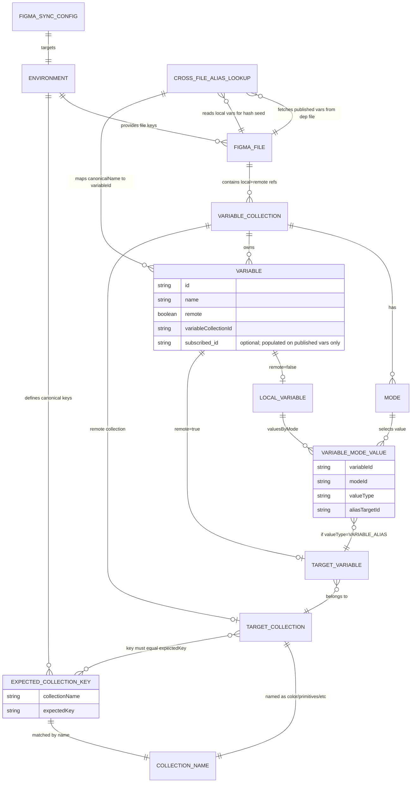
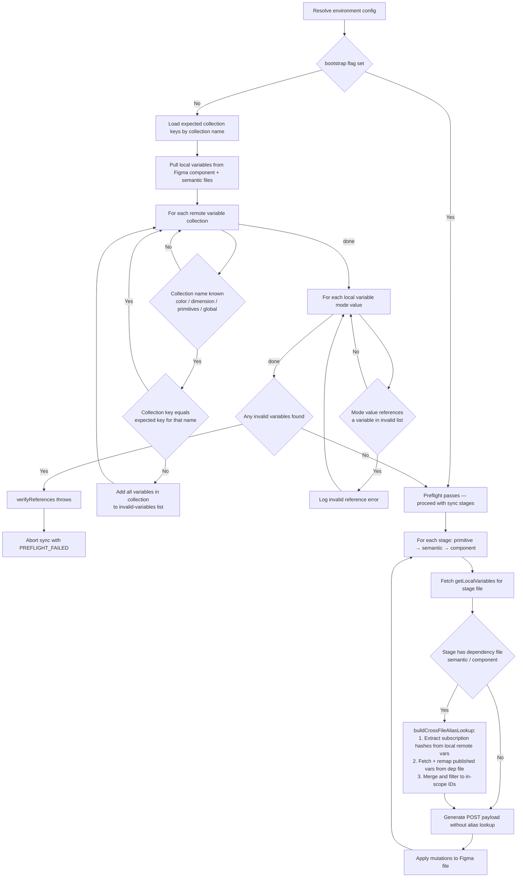

# Figma Sync Data Model Documentation

This document describes the data model and operational flows for the Figma token sync system. For setup, environment variables, and command reference, see [README.md](README.md). For CLI flag semantics and safety contracts, see [contracts/figma-sync-cli-contract.md](contracts/figma-sync-cli-contract.md).

## Entity Relationship Diagram

The diagram below models the core entities the sync system reads and writes. The three Figma files (`primitive`, `semantic`, `component`) each own local variable collections. The `semantic` and `component` files also subscribe to upstream libraries, creating remote variable references whose validity is enforced by preflight.

`CROSS_FILE_ALIAS_LOOKUP` represents the inline alias resolution performed during a push for stages that depend on another file. Because Figma assigns a unique subscription hash per subscriber relationship, the `subscribed_id` values returned by `GET /variables/published` on the dependency file do not directly match the IDs the subscriber file uses. The lookup performs a two-pass remap — extracting the subscriber's actual hash from its existing remote variables, rewriting all published `subscribed_id` values to use that hash, then filtering to IDs already present in the subscriber's local variable list — before building the `canonicalName → variableId` map passed to the POST payload.

## Preflight and Sync Flow Diagram

The diagram below shows the complete execution path from config resolution through preflight validation and the three-stage sync.

**Upper half (preflight):** if `--bootstrap` is set, the entire check is skipped and preflight immediately passes — use this only for initial setup of a new environment. Otherwise, `verifyReferences` scans remote collections by name; for any collection whose key doesn't match the expected value, it collects all member variable IDs into an invalid list, then checks whether any local variable's mode values reference those IDs. A mismatch aborts the run with `PREFLIGHT_FAILED`.

**Lower half (stage loop):** runs only after preflight passes. For stages that depend on another file (`semantic` depends on `primitive`; `component` depends on `semantic`), `buildCrossFileAliasLookup` is called before generating the POST payload.

