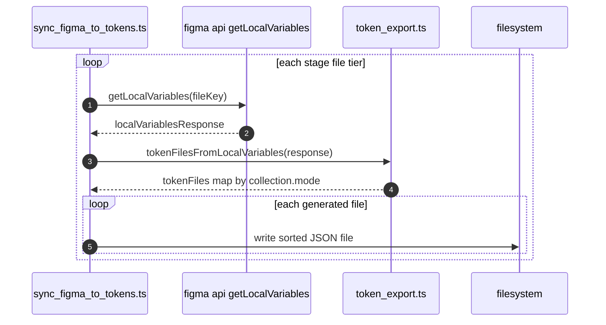
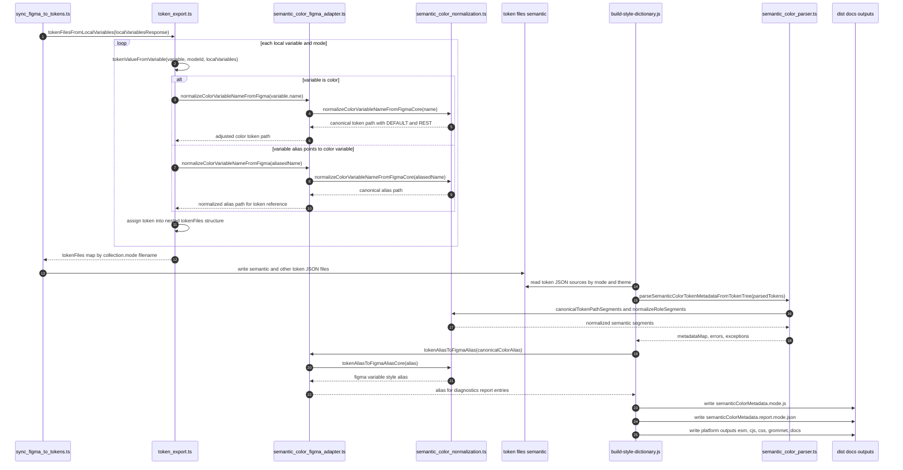
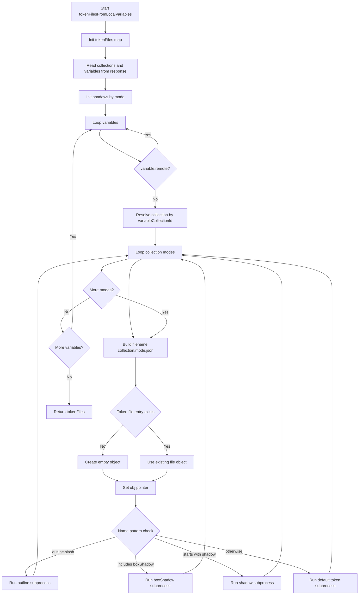
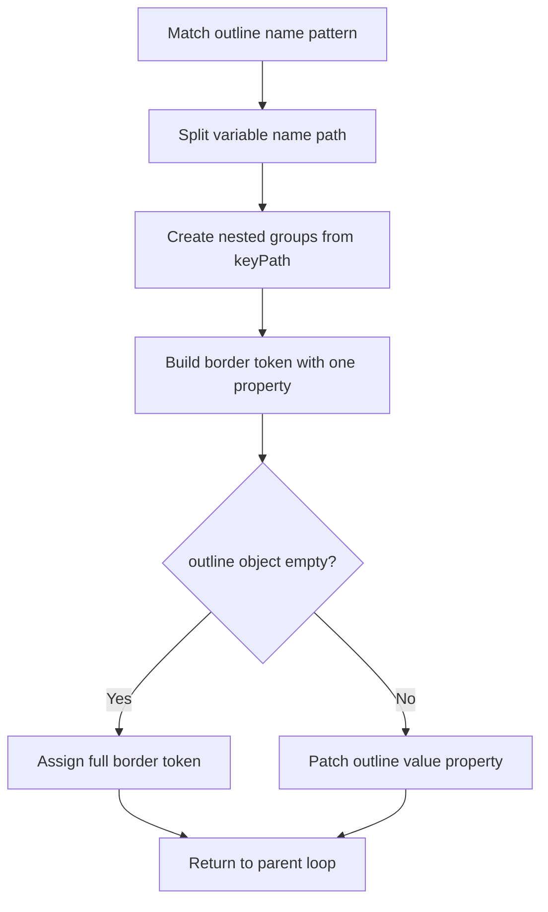
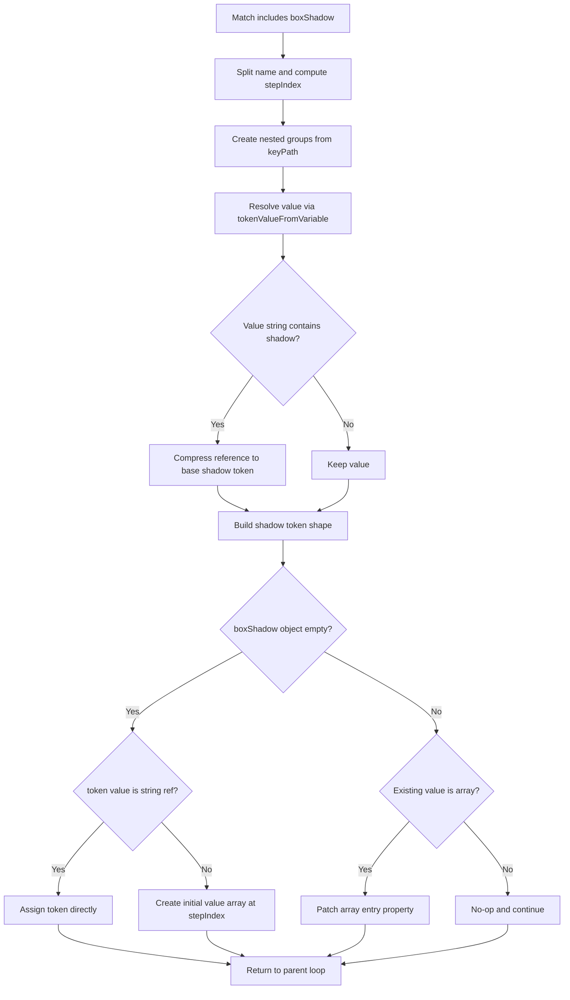
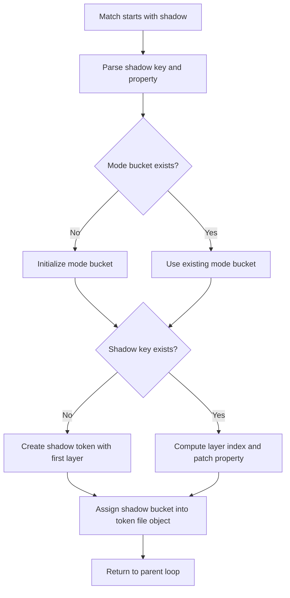
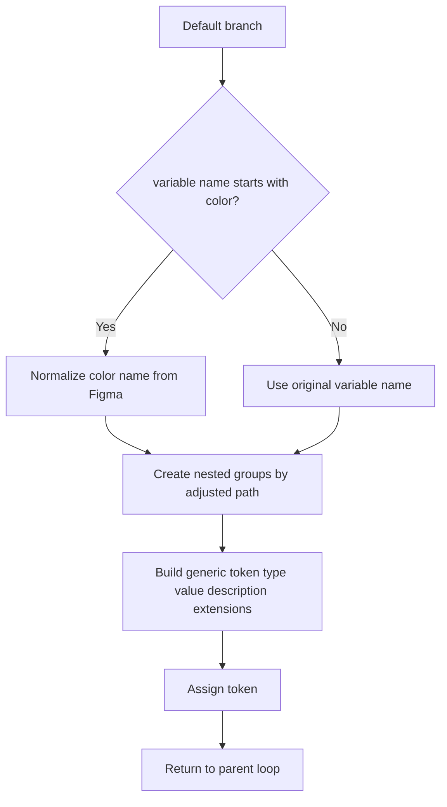
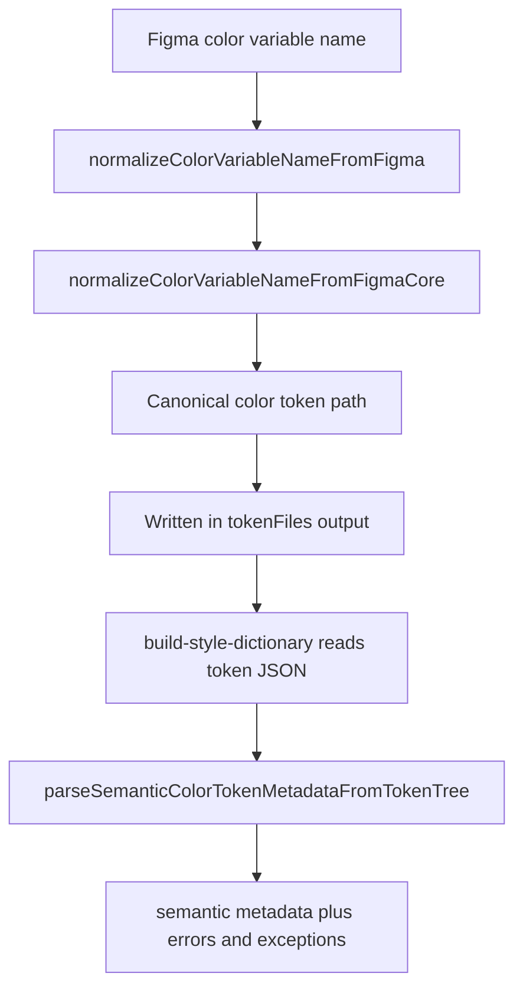
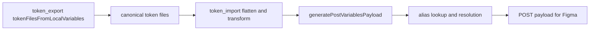

# Figma Token Export Architecture

This document captures the export architecture centered on
`tokenFilesFromLocalVariables` in [src/token_export.ts](../src/token_export.ts),
including downstream normalization, import relationship context, and build
diagnostics integration.

## Current Scope

- Function: `tokenFilesFromLocalVariables`
- Called by: `src/scripts/sync_figma_to_tokens.ts` (runtime sync), `src/scripts/update-semantic-color-parity-fixtures.ts` (fixture generation), and related tests
- File: [src/token_export.ts](../src/token_export.ts)
- Focus: end-to-end context, branch-level control flow, and diagnostics surfaces

## End-to-End Export Transaction Sequence

This section captures the runtime export flow from Figma local variables to
written token files.

### Runtime caller path

1. `src/scripts/sync_figma_to_tokens.ts` requests local variables per stage.
2. `tokenFilesFromLocalVariables` transforms variables into token file objects.
3. Stage output files are sorted and written to disk by stage directory.

### Non-runtime caller path

1. `src/scripts/update-semantic-color-parity-fixtures.ts` invokes export
   logic for golden fixture generation.
2. Export-focused tests validate shape and behavior (including parity).

## Sequence Diagram: Export, Normalization, and Build

## Control Flow Diagram

### Subprocess Diagram: outline branch

### Subprocess Diagram: boxShadow branch

### Subprocess Diagram: shadow branch

### Subprocess Diagram: default token branch

### Notes on Data Mutation

- tokenFiles is written incrementally by fileName and nested key path.
- shadows is a temporary mode-scoped accumulator used by the shadow branch.
- tokenValueFromVariable performs alias handling and color normalization for aliased color values.

## Semantic Color Normalization and Parsing Contract

Export-side color naming is normalized through the semantic color adapter and
shared normalization core, then consumed later by semantic color parsing in
build metadata generation.

### Contract highlights

1. Export normalizes Figma color names to canonical token path shape.
2. Alias values targeting color variables are normalized before reference
   string generation.
3. Build metadata parsing consumes normalized canonical paths and emits
   metadata plus exception/error diagnostics.

## Relationship to Import Flow and Alias Resolution

Export and import are complementary but not identical. Export focuses on
transforming local Figma variables into token files, while import focuses on
flattening token files and generating POST payload mutations for Figma.

### Symmetry and asymmetry

| Concern               | Export flow                                                          | Import flow                                                                         |
| --------------------- | -------------------------------------------------------------------- | ----------------------------------------------------------------------------------- |
| Color naming boundary | normalize Figma names to canonical paths                             | convert canonical aliases back to Figma naming when resolving alias targets         |
| Alias handling        | normalize color alias target names during export value serialization | resolve aliases against existing and planned variables, with lookup/error reporting |
| Output                | tokens grouped by collection/mode files                              | API payload with CREATE/UPDATE/DELETE operations                                    |

## Relationship to Build Artifact Generation

After export and token writing, the build pipeline consumes token JSON and
produces runtime artifacts plus semantic metadata documentation artifacts.

### Artifact mapping

| Source                                 | Processor                                     | Output                                                          |
| -------------------------------------- | --------------------------------------------- | --------------------------------------------------------------- |
| `tokens/semantic/color.*.json`         | `build-style-dictionary.js` + semantic parser | `dist/docs/metadata/semanticColorMetadata.*.js`                 |
| `tokens/semantic/color.*.json`         | metadata report writer                        | `dist/docs/metadata/semanticColorMetadata.report.*.json`        |
| primitive/global/component token files | style dictionary platforms                    | `dist/esm`, `dist/cjs`, `dist/css`, `dist/grommet`, `dist/docs` |

### Build linkage notes

1. Build script parses semantic color token trees into metadata.
2. Build script cross-checks canonical token names against Figma alias form for
   report generation.
3. Build emits both runtime token bundles and docs/report artifacts.

## Error Handling and Diagnostics Surfaces

The following table maps key diagnostic surfaces across export, import, and
build.

| Component                   | Error or warning type                             | Surface                                         | Typical remediation                                                |
| --------------------------- | ------------------------------------------------- | ----------------------------------------------- | ------------------------------------------------------------------ |
| `token_export.ts`           | invalid variable value format throw               | sync script runtime failure                     | inspect offending variable shape and source collection data        |
| `token_import.ts`           | alias resolution errors (`ALIAS_NOT_FOUND`, etc.) | payload generation callback and stage reporting | verify alias target exists in lookup or planned payload set        |
| `semantic_color_parser.ts`  | parse errors and semantic exceptions              | metadata export and report JSON                 | normalize token path segments or explicitly handle exceptions      |
| `build-style-dictionary.js` | semantic metadata export failure (`failOnErrors`) | build failure                                   | fix invalid semantic color token names before rebuild              |
| style dictionary platforms  | filtered reference warnings in CSS outputs        | build logs warnings                             | validate intended filter/reference behavior and token dependencies |

### Diagnostics output locations

1. Stage/run status events from sync scripts.
2. Semantic metadata error/exception exports in docs metadata artifacts.
3. Semantic report JSON files under `dist/docs/metadata`.

### Exception taxonomy in metadata reports

The report now uses a generalized `exceptions` bucket instead of a
`noRoleExceptions` bucket:

1. `canonical.exceptions` for parser exceptions generated from canonical token
    trees.
2. `figmaVariables.exceptions` for Figma-normalized path exceptions.

Current exception codes:

1. `NO_ROLE_EXCEPTION`: token has no semantic role and requires explicit
    downstream handling.
2. `NON_CANONICAL_ROLE_EXCEPTION`: token role payload is non-canonical but
    accepted in soft-exception mode for reporting and remediation.
