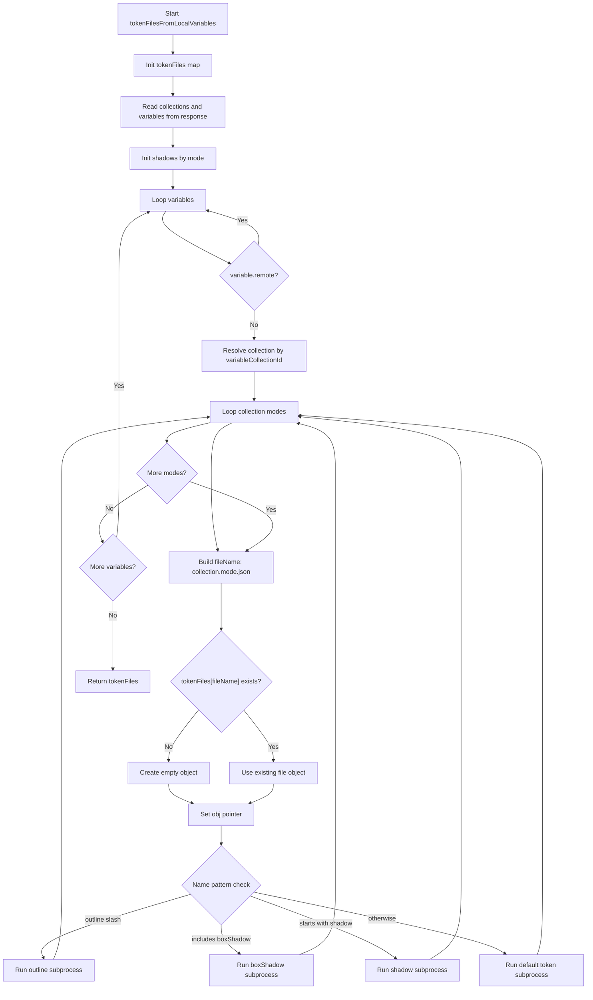
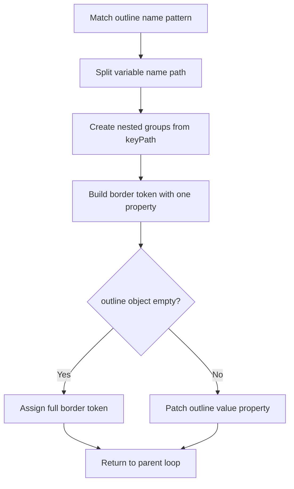
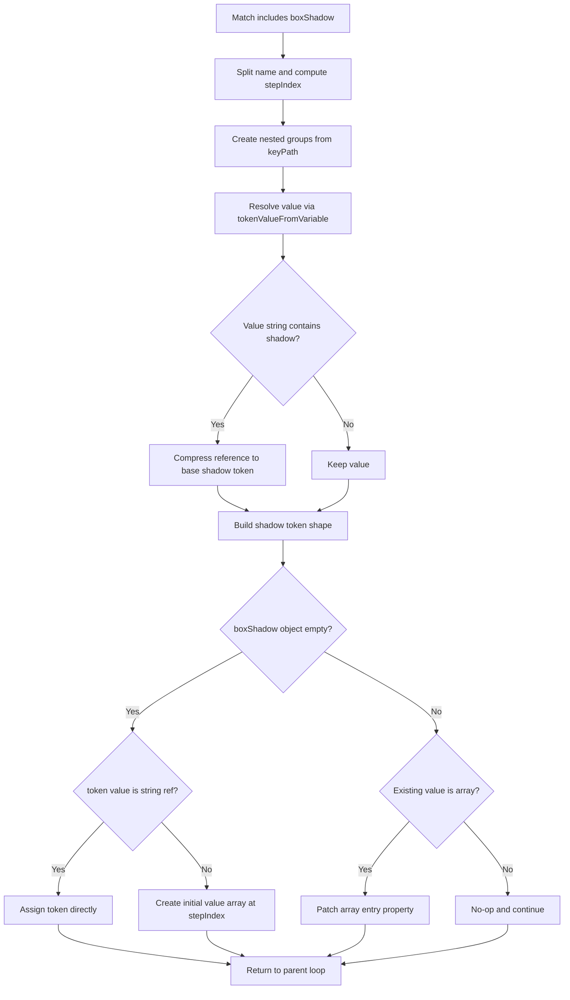
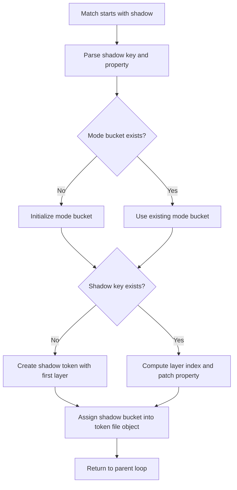
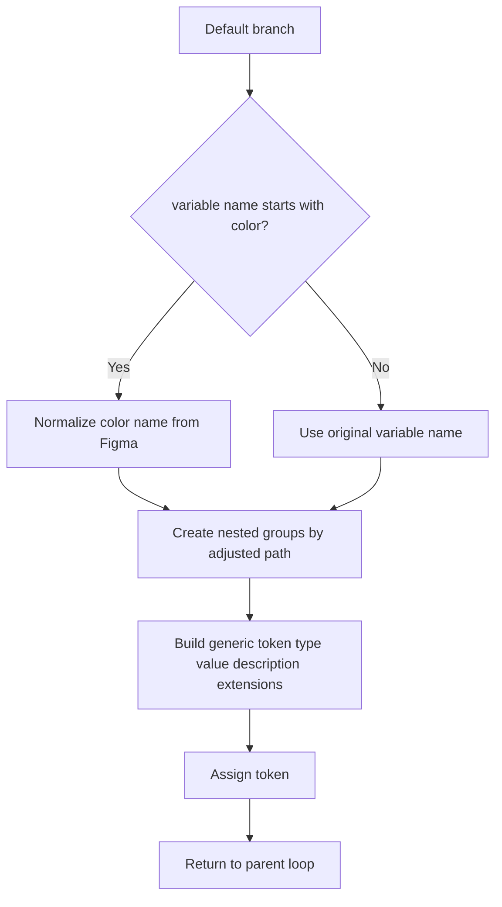
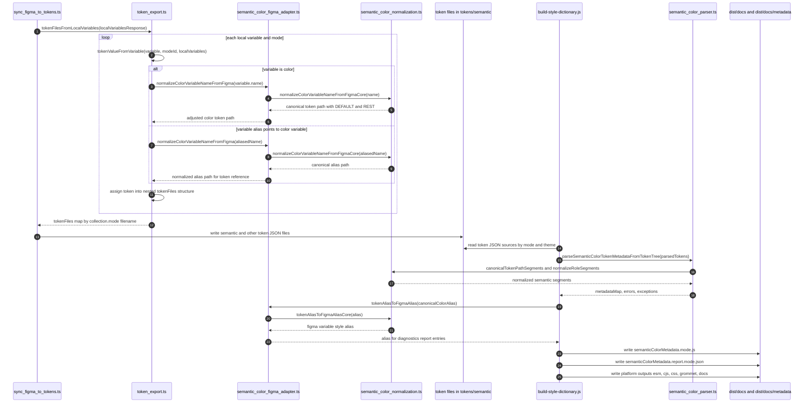

# token_export Control Flow

This document captures control flow for `tokenFilesFromLocalVariables` in [src/token_export.ts](../src/token_export.ts).

## Current Scope

- Function: `tokenFilesFromLocalVariables`
- Called by: `src/scripts/sync_figma_to_tokens.ts` (runtime sync), `src/scripts/update-semantic-color-parity-fixtures.ts` (fixture generation), and related tests
- File: [src/token_export.ts](../src/token_export.ts)
- Focus: branch-level control flow and key data mutations

## Control Flow Diagram

### Subprocess Diagram: outline branch

### Subprocess Diagram: boxShadow branch

### Subprocess Diagram: shadow branch

### Subprocess Diagram: default token branch

### Notes on Data Mutation

- tokenFiles is written incrementally by fileName and nested key path.
- shadows is a temporary mode-scoped accumulator used by the shadow branch.
- tokenValueFromVariable performs alias handling and color normalization for aliased color values.

### Suggested Expansion Sections

- End-to-end Figma-to-token export transaction sequence.
- Interaction with normalizeColorVariableNameFromFigma and semantic color parsing contracts.
- Relationship to import flow in token_import and alias resolution.
- Relationship to build artifact generation in scripts/build-style-dictionary.
- Error handling and diagnostics surfaces across export/import/build.

## Sequence Diagram: Export, Normalization, and Build

